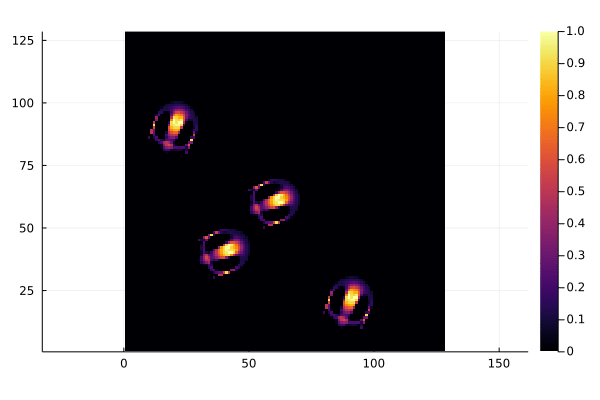

# Cyto.jl

Cellular Automata in Julia

Try out the demonstration of Lenia, a smooth, beautiful cellular automaton universe by ([Chan 2019](https://arxiv.org/abs/1812.05433)) using a mybinder notebook:

[  https://mybinder.org/v2/gh/riveSunder/Cyto.jl/master?labpath=Lenia.ipynb](https://mybinder.org/v2/gh/riveSunder/Cyto.jl/master?labpath=Lenia.ipynb)
